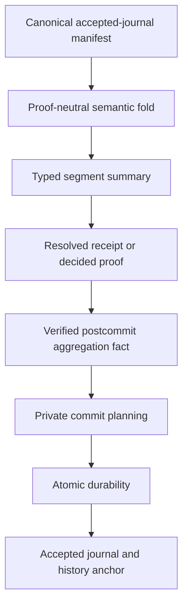

# ZRM frontier synthesis

## Outcome

The leading candidate from this research run is not “one recursive
accumulator.” It is a small family of typed semantic relations with replaceable
proof adapters:



The proof adapter may use RISC Zero composition now and HyperNova, ProtoStar,
ProtoGalaxy, CycleFold, or another PCD backend later. None of those choices is
allowed to define the ordered journal, accounting meaning, policy context,
replay identity, data-availability conclusion, or durable commit.

## Ten highest-value breakthroughs

### 1. The semantic manifest, not the proof tree, is the object

Define `summaryOf(ordered nonempty AcceptedJournal segment)` independently of
any receipt. A proof tree is a cache or witness that its node equals the fold of
the exact manifest. Every Catalan parenthesization of one ordered leaf list must
produce identical semantic bytes; every omission, duplication, gap, overlap,
or nontrivial permutation must reject or change the ordered root.

ARM's batch guest demonstrates RISC Zero assumption verification and recursive
resolution, but republishes complete child-instance arrays and does not enforce
ZRM state continuity, accepted status, global uniqueness, durable ordering, or
commit. Proof compression is therefore not yet semantic or public-output
compression for ZRM.

Relevant primary sources: [RISC Zero composition](https://dev.risczero.com/api/zkvm/composition),
[PCD](https://projects.csail.mit.edu/pcd/), and
[PCD from accumulation](https://eprint.iacr.org/2020/499).

### 2. Recursive accounting needs strong definedness independence

It is insufficient to prove `compose (compose a b) c = compose a (compose b c)`
only when both expressions return values. For signed bounded nets, cancellation
produces a smaller counterexample:

```text
bound = 127
(127 + 1) + (-1)  -> undefined at the first addition
127 + (1 + -1)    -> 127
```

Store `AccountingAggregateRowV1 { dimension, debit_total, credit_total }` with
bounded natural limbs. Positive and negative leaf deltas map to separate limbs;
merge adds limbs monotonically; a signed net is derived only where a boundary
rule needs it. Equal nonzero limbs remain committed even when their net is zero.

The Lean module `AccountingStrongAssociativity` proves:

- the signed definedness counterexample;
- associativity of limb merge;
- unconditional Option-level equality of both checked three-leaf folds;
- success when full monotone totals fit; and
- additivity of the signed net projection.

If the eventual schema proves all recursive quantities nonnegative, that must
be an explicit theorem. It cannot remain an informal assumption.

### 3. A recursive trace is indexed by both state and context

Model a semantic step as:

```text
Step : (PreState, PreContext) -> (PostState, PostContext)
```

Ordinary resource steps require `PreContext = PostContext`. A distinct governed
`ContextBridge(old, new, command)` changes policy, verifier release, proof
adapter, cost model, registry, or acceleration-catalog roots. The bridge must
bind authorization, predecessor, successor, replay scope, activation epoch, and
fact invalidation semantics.

This is the application-level lesson from non-uniform IVC: heterogeneous step
circuits need a common typed context and authenticated routing. HyperNova and
SuperNova do not define ZRM upgrade semantics; they merely show how a fixed
circuit family can authenticate selected steps.

### 4. Separate the laws of five algebras

Do not expose an undifferentiated “accumulator root” with one implicit merge
law. Distinct newtypes or a type-indexed generic framework can encode:

| Type | Operation | Critical property |
|---|---|---|
| `CanonicalSet<T>` | exact disjoint union | permutation-invariant, duplicate-rejecting |
| `OrderedTrace<T>` | append | associative and intentionally noncommutative |
| `TypedEffectMap<K,V>` | type-specific merge | exact coverage and explicit bounds |
| `StateContextPath<S,C>` | endpoint composition | adjacent state and context equality |
| `DurableBundle` | atomic commit | authority only after durable outcome |

Sorting is valid only for an explicitly unordered set. Worker completion order,
proof topology, and canonical set sorting must never define journal order.

### 5. Parallel execution is canonical serial refinement

Authenticate a preset ordered batch manifest. Workers may speculate in any
order against one immutable snapshot, but validation must produce exactly the
sequential result in manifest order. A stale observation deterministically
reexecutes or rejects; worker timing cannot select the public failure.

The candidate precommit certificate contains:

```text
ConcurrencyCertificateV1 {
  pre_state_head_root
  ordering_context_root
  ordered_transition_manifest_root
  per_transition[position, statement_hash,
                 read_dependency_root, write_intent_root,
                 semantic_effects_root]
  dependency_edges_root
  deterministic_result_vector_root
  sequential_state_root_chain_root
  scheduler_profile_id
}
```

It is evidence for validation, never a commit capability or accepted journal.
The bounded oracle finds 168 false-safe schedule checks under write-only
certification and none under fact-complete certification in its domain. The
stronger batch oracle produces one semantic result across every explored worker
schedule and kills write-skew and range-phantom mutants. Two additional mutants
show that a program-read-only root omits the nullifier guard and candidate-state
invariant reads; the revised phased decision root distinguishes both cases.

Those models trust their declared semantic footprints. They test serial
refinement and observation substitution after a footprint exists; they do not
prove that arbitrary transition code disclosed every read. That separate
mediation obligation is the subject of the next hypothesis.

Primary sources: [Block-STM](https://arxiv.org/abs/2203.06871v3),
[Calvin](https://cs.yale.edu/homes/thomson/publications/calvin-sigmod12.pdf),
[Aria](https://pages.cs.wisc.edu/~yxy/pubs/aria.pdf), and the classic
[snapshot-isolation write-skew analysis](https://people.eecs.berkeley.edu/~kubitron/courses/cs262a-F13/handouts/papers/p729-cahill.pdf).

### 6. Exact reads require complete mediation

Authenticating a caller-declared read set does not prove that the declaration
covers every state access. A sealed snapshot reader is one high-assurance
design: semantic code obtains state only through a mediator that records:

- point observations: namespace, key, version, present value hash or absence;
- range/predicate observations: index profile, bounds or predicate, result root,
  count, and a completeness witness;
- snapshot state-head root, accumulator profile, and validation-context hash.

Range observations need boundary or gap evidence because tracking returned rows
alone misses phantoms. Proof bytes are not semantic identity: multiple proof
encodings may authenticate the same logical observation.

This separates two obligations that the literature treats at different layers.
An authenticated index can prove completeness of one query result, while an
instrumented evaluator, verified effect system, or equivalent confinement proof
must establish that all semantic reads went through the declared query
interface. Silo motivates dynamic read validation; authenticated index
structures motivate query-result authenticity and completeness. Neither alone
proves arbitrary-program access completeness.

Primary sources: [Silo](https://wzheng.github.io/silo.pdf) and
[dynamic authenticated index structures](https://users.cs.utah.edu/~lifeifei/papers/sigmod06-btree.pdf).

### 7. Private logic needs a common envelope plus an explicit leakage class

VERIZEXE shows that an outer proof can verify inner predicate proofs and keys as
private witnesses while exposing commitments to the application relation. For
ZRM, the outer program should verify:

- the exact resource statement and hidden inner receipt;
- typed registry membership and nonrevocation;
- the validation-context and policy roots;
- a declared semantic class and conservative cost bucket; and
- a hiding commitment to the inner logic set.

Privacy must be stated as noninterference modulo the explicit public class, not
total program indistinguishability. The leakage budget includes public fields,
sizes, timing buckets, registry roots, error classes, data-availability
identifiers, and scope nullifiers. The ARM audit's program-identity finding is a
concrete motivation, not proof that this construction is sufficient.

Primary sources: [VERIZEXE](https://www.usenix.org/system/files/sec23fall-prepub-277-xiong-alex.pdf),
[ZEXE](https://eprint.iacr.org/2018/962), and
[zk-creds](https://eprint.iacr.org/2022/878).

### 8. Economic identity and proof identity are different

`SemanticSegmentHash` keys replay and economic meaning. `ProofNodeIdentity`
separately binds proof backend, relation, release, control root, children,
topology, curves, commitments, auxiliary accumulators, and final-decider result.
Alternative proof encodings or balanced versus left-deep trees for the same
semantic segment must not consume two replay slots or earn twice.

This separation does not solve cryptographic malleability. The Nova cycle-of-
curves implementation history shows why proof-system code and cross-curve
linkage need adversarial review even when the high-level paper is sound.

Primary sources: [Revisiting Nova](https://eprint.iacr.org/2023/969) and
[simulation-extractability of PCD](https://eprint.iacr.org/2025/2037).

### 9. Use typed registry roles and an authenticated-state port

Keep policies, verifier images, proof adapters, cost models, and acceleration
data in domain-separated typed roles. These may be independent roots or
type-indexed views committed by a common forest root; the security requirement
does not prescribe one physical tree layout. Core semantics consume sealed
logical point, range, exact-update, and history facts. A backend profile binds
canonical key namespaces, roots, proof formats, bounds, and update semantics.

This lets a reference sorted map and later authenticated trees refine one
logical oracle. Accumulator migration is a separately governed operation proving
exact map equivalence or replaying a canonical snapshot; it is not an ordinary
transition that silently changes profile identity.

### 10. Research promotion itself should be proof-carrying

The current Research Kernel helped discovery but is not reconstructive evidence.
ZRM research infrastructure should use immutable evidence receipts and immutable
promotion receipts. A policy evaluates independent support and refutation bits:

| Support | Refutation | Truth view |
|---:|---:|---|
| 0 | 0 | `INCONCLUSIVE` |
| 1 | 0 | `SUPPORTED` |
| 0 | 1 | `REFUTED` |
| 1 | 1 | `CONTESTED` |

Staleness is an orthogonal overlay. Assurance is a vector—authenticated,
replayed, reproducible, semantically checked, transparent, and fresh—not a
single scalar. Policy or checkpoint changes create new receipts and never
rewrite historical evidence.

Proof-carrying promotion borrows the proof-carrying-authentication pattern: the
requester supplies exact checkable material, while a small verifier checks a
versioned policy. PCA does not establish empirical truth, and neither PCA nor
TUF supplies the four-valued evidence semantics proposed above.
[Proof-Carrying Authentication](https://www.cs.princeton.edu/~appel/papers/says.pdf),
[in-toto attestations](https://github.com/in-toto/attestation/blob/676ab5f26a246c99dfa5ee541c1c77a9c9f1499a/spec/README.md),
and [DSSE](https://github.com/secure-systems-lab/dsse/blob/8fca562ae08478e4f8d94680040b6456697fa41a/protocol.md)
provide useful source material, but signed provenance still does not imply
semantic truth.

## Folding backend comparison

| Backend idea | ZRM-relevant strength | Architecture boundary |
|---|---|---|
| RISC Zero composition | deployed child-assumption and resolution control flow | guest journal and application semantics remain ZRM's responsibility |
| HyperNova/SuperNova | non-uniform state-machine recursion with instruction-proportional proving | application routing, context, and upgrade meaning remain ZRM obligations |
| ProtoStar | generic accumulation and non-uniform Plonk IVC with high-degree gates and vector lookups | selector and registry must bind the exact ZRM action and context; ProtoStar is not itself a ZRM router |
| ProtoGalaxy | efficient folding of several compatible instances | algebraic batching does not prove order, interval exactness, or state adjacency |
| CycleFold | moves a few wrong-field group operations into a small auxiliary circuit | optimization only; both accumulators and cross-circuit linkage require final decision |
| PCD from multifolding | arbitrary incoming-edge proof DAGs | closest abstraction for parallel segments, after exact interval semantics exist |

Keep `fold_one`, `fold_many`, `decide`, and `compress` distinct. Benchmark a
HyperNova-style per-kind design against a ProtoStar-style selector relation on
the same `ContextV1` and trace corpus before selecting either. Defer ProtoGalaxy
until binary composition is correct and CycleFold until profiling identifies
non-native group arithmetic as the bottleneck.

## Recommended next theorem and model packages

1. `ManifestPCD`: exact append refinement; arbitrary-tree equality; nonempty
   preservation; interval exactness; omission, duplication, gap, overlap, and
   permutation rejection; conditional collision-freedom only over exact bounded
   canonical preimages.
2. `EvidenceAuthority`: type-state separation for conditional/resolved receipts,
   deferred/decided accumulators, and verified postcommit facts; no constructor
   path from pending evidence to authority.
3. `ContextBridge`: ordinary context preservation, governed bridge activation,
   fact non-reinterpretation, bridge replay prevention, and indexed-path
   associativity.
4. `ExactFootprintSerialRefinement`: sealed read coverage, range completeness,
   deterministic reexecution, preset-order equivalence, and schedule-independent
   journal construction.
5. `PromotionDecision`: four-valued evidence, SCC anti-bootstrap, exact scope
   comparison, deterministic receipts, and exact descendant invalidation.

## Decisions

Keep now:

- the proof-neutral semantic plane and separate typed algebras;
- monotone accounting limbs;
- executable mutation oracles and small Lean proofs;
- exact context, manifest, fact, release, registry, and authority binding;
- immutable negative evidence and precise falsifiers.

Defer:

- a production folding scheme selection;
- multi-folding, CycleFold, or recursive proofs over the evidence graph;
- public transparency of private evidence beyond commitments;
- an I-confluent fast path until exact read/effect coverage exists.

Reject:

- proof or scheduler receipts as durable commit authority;
- proof-system zero as a semantic empty transition;
- nullifier-only or write-only commutativity;
- sorting an ordered journal;
- one undifferentiated root and operation for sets, traces, maps, paths, and
  durability;
- mutable scalar research status or producer-declared promotion evidence;
- global hash injectivity assumptions in Lean.

## Explicit nonclaims

- No folding system, curve, commitment, transcript, or final SNARK is selected.
- No model proves the Rust implementation, consensus, finality, data
  availability, storage durability, or production security.
- A RISC Zero receipt does not prove current state, global uniqueness, durable
  commit, accepted status, or external availability unless ZRM binds and checks
  those statements.
- Constant proof size does not imply constant public journal, audit bundle,
  witness retention, or data-availability bandwidth.
