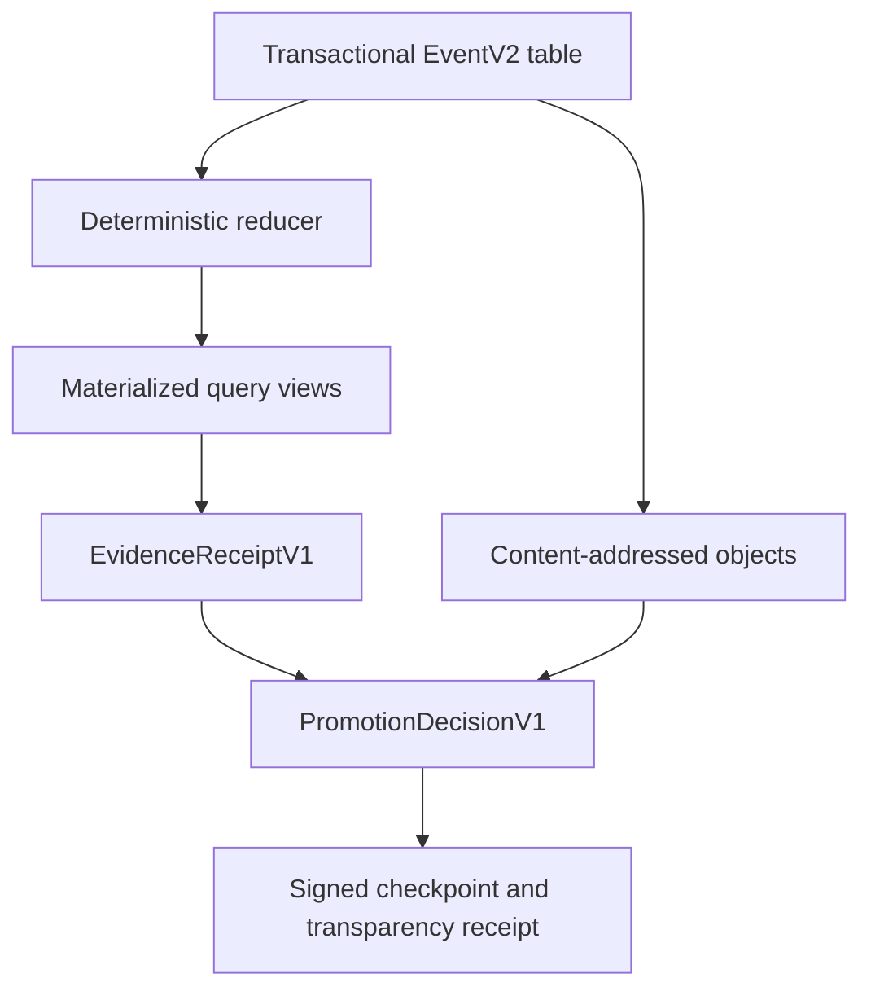

# Research Kernel compounding report

## What ran

Three MCP runs used the pinned Research Kernel revision
`d9cdfceaa396dd56acfacbd042b89ce633dbc173` through its actual stdio server.
Each later run retrieved prior atoms before authoring new hypotheses.

| Run | Purpose | Output |
|---|---|---|
| `zrm-frontier-v2-2026-07-14` | ARM/ZRM seed | 22 atoms, 13 edges, 6 refutation plans, 2 evidence records, 5 reformulations |
| `zrm-privacy-policy-v1-2026-07-14` | privacy and policy receipts | 12 hypotheses, 39 edges, 12 refutation plans, 4 evidence records, 18 reformulations |
| `zrm-compound-architecture-v2-2026-07-14` | recursion, concurrency, privacy, assurance | retrieved 40 atoms; 10 hypotheses, 21 edges, 10 refutation records, 3 evidence records, 6 reformulations |

The first run also attempted a promotion with an unsatisfied dependency and the
kernel rejected it. The compound run recorded the bounded signed-addition
definedness witness as an actual counterexample. Research Kernel Morph output
was used only to generate reformulation templates; it was not represented as
strict Morph proof-search replay.

The deterministic curated projection is
[`knowledge_graph.json`](knowledge_graph.json). Exact run counts and limitations
are recorded in [`evidence/research-kernel-runs-v1.json`](evidence/research-kernel-runs-v1.json).

## What the kernel helped discover

Compounding materially changed the frontier:

1. The seed “total carrier” claim was too weak. The later recursion run found
   that equality when both signed folds are defined does not imply equal
   *definedness*. This produced the monotone debit/credit design and a Lean
   theorem.
2. The seed “same validation context” rule blocked long chains across policy
   upgrades. Privacy and non-uniform IVC work together suggested an indexed
   path with explicit governed context bridges.
3. A generic fact-complete commutativity idea became canonical-order serial
   refinement with sealed point and range observations, deterministic
   reexecution, and a non-authoritative concurrency certificate.
4. A common private logic image became a more exact outer envelope with typed
   registry forest membership, nonrevocation, semantic/cost classes, and a
   machine-readable leakage budget.
5. Tool evidence itself became part of the research problem: immutable
   challenge-bound evidence receipts, four-valued promotion, and an orthogonal
   assurance vector now form a proposed force multiplier.

## Limits observed in the pinned kernel

The current kernel is useful as an index and ideation aid, but not as an
authority-bearing evidence store:

- event records omit enough input and record state to reconstruct the database;
- there is no import or deterministic replay path;
- SQLite and JSONL are dual-written, with JSONL written before the enclosing DB
  transaction commits;
- reads and reports append semantic-looking events;
- UUIDs and wall time make IDs and event bytes nondeterministic;
- reports and graph exports omit parts of evidence, experiments, artifacts, and
  promotions;
- atom creation can assign `SUPPORTED` directly;
- promotion trusts caller strings and booleans such as contradiction-search or
  replay assertions;
- artifact and raw-log redaction is not a complete authority boundary.

For those reasons, this packet does not import Research Kernel status as ZRM
evidence. It independently records sources, falsifiers, exact experiment scope,
nonclaims, and artifact digests.

## Proposed force multiplier

The recommended evidence kernel is a hybrid:



### EventV2

Each semantic write emits one complete reconstructive row. Reads and access
telemetry are outside the semantic chain.

```json
{
  "_type": "https://zrm.dev/rk/Event/v2",
  "run": "rk:sha256:<genesis>",
  "seq": 42,
  "op": "atom.add",
  "op_version": 1,
  "prev_event": "sha256:<h41>",
  "pre_state": "sha256:<s41>",
  "input": {},
  "records": [],
  "objects": [{"role": "evidence", "digest": {"sha256": "..."}}],
  "policy_root": "sha256:<p>",
  "toolchain_root": "sha256:<t>",
  "post_state": "sha256:<s42>"
}
```

`event_hash = SHA256("zrm-rk-event-v2\0" || JCS(event_without_hash))`.
The canonical profile rejects floats, NaN, duplicate keys, non-NFC strings,
unsafe paths, and implicit sorting. Scores are fixed-point integers. Arrays are
sorted only when their schema says “set”; ordered traces remain ordered.

Construct the full event and materialized changes, insert both in one SQLite
transaction, then commit. Generate JSONL only by reading committed rows. A
fault before commit yields the old state; a fault after commit yields the full
new state.

### EvidenceReceiptV1

Use an in-toto Statement whose subjects bind exact claim, source, artifact, and
binary digests. Sign exact typed payload bytes with DSSE or a profiled COSE
envelope. The predicate binds:

- immutable claim statement, semantic/media type, scope, bounds, assumptions,
  and nonclaims;
- materials and their roles;
- argv as an array, safe working directory, environment allowlist, and source
  revision;
- verifier source/binary, toolchain, dependency graph, and policy digests;
- PASS, FAIL, or INCONCLUSIVE plus output and counterexample digests;
- checker type, challenge, theorem type, axiom report, and declaration;
- reproducibility and signature/transparency material.

A Lean receipt additionally binds the trusted challenge statement, module and
declaration, `#print axioms` output, Lake manifest, proof artifact, Lean binary,
and independent checker. Reject `sorryAx`, unapproved axioms, arbitrary source
execution, and theorem or toolchain substitution.

### PromotionDecisionV1

Input is `(immutable claim version C, checkpoint K, policy P, reference context
T)`. The result is a new immutable receipt, never an update to C.

The four-valued result below is a proposed engineering evidence model. PCA
motivates proof-carrying requests and TUF motivates versioned trust policy, but
neither source establishes this support/refutation semantics or empirical truth.

1. Resolve only graph and object versions reachable at K.
2. Verify exact receipt envelopes, bytes, claim semantics, scope, toolchain,
   checker, and result. Unknown profiles are ineligible.
3. Evaluate assurance coordinates independently: authenticated, replayed,
   reproducible, semantic proof, transparent, and fresh.
4. Replay adapters return only PASS, FAIL, or INCONCLUSIVE plus a receipt.
5. Reject dangling references and malformed cycles. A support SCC cannot
   bootstrap without an exogenous policy-trusted seed.
6. Accept refutation only for the same semantic scope or a policy-defined
   stronger scope.
7. Derive independent support and refutation bits and therefore INCONCLUSIVE,
   SUPPORTED, REFUTED, or CONTESTED.
8. Apply expiry, revocation, and key policy as an orthogonal freshness overlay.
9. Bind every eligible and ineligible receipt plus structured reason code into
   `PromotionReceiptV1`.
10. Identical inputs and verifier roots must yield byte-identical output.

### Replay and transparency

A replay bundle contains `manifest.json`, ordered `events.v2.jsonl`, deterministic
snapshots, content-addressed objects, attestations, checkpoints, and toolchains.
Replay verifies resource limits and member digests, the contiguous event chain,
every pre/post root, typed references and policies, evidence receipts, final
state, and bundle roots.

An external signed checkpoint is necessary to detect suffix truncation and
rollback. Inclusion plus consistency plus gossip or multiple witnesses is
necessary to detect split views. Transparency proves accountable history, not
truth; semantic validation remains a separate assurance coordinate.

## Release gates for the force multiplier

- 10,000 generated event histories: live and replay roots must always match;
  every defined single mutation must reject.
- fault injection at every DB write, commit, and export boundary: restart is
  always old state or complete new state.
- independent Rust and Python canonicalizers/reducers: identical roots on an
  adversarial Unicode, ordering, type, and size corpus.
- receipt substitution corpus: changing claim, media type, scope, assumptions,
  toolchain, checker, or output must reject.
- promotion corpus: zero promotions from producer booleans, unrelated evidence,
  or self-support cycles; support plus refutation must be CONTESTED.
- Lean corpus: `sorry`, custom axiom, theorem alias, challenge swap, artifact,
  and toolchain substitutions all reject under the high-assurance profile.
- deliberate transparency fork and rollback: two gossiping monitors detect the
  seeded split within the declared interval.

Do not add recursive SNARKs over the research graph before deterministic bytes,
reconstructive events, exact receipts, and a small independently checkable
verifier exist. Recursion over ambiguous evidence only compresses ambiguity.
